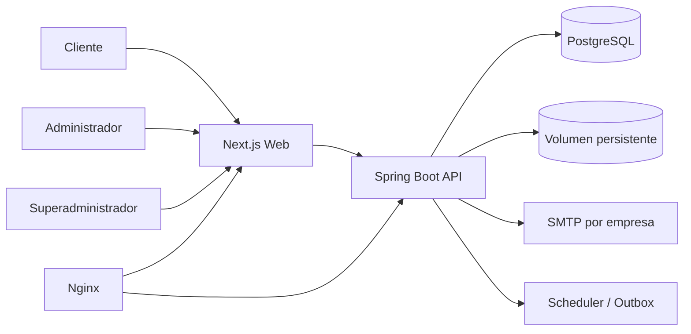

# Arquitectura

## Vista general

## Monolito modular

Módulos backend propuestos:

- identity-access;
- platform-administration;
- companies;
- branches;
- employees;
- customers;
- catalog;
- scheduling;
- appointments;
- notifications;
- media;
- reporting;
- website-content;
- legal-compliance;
- audit;
- shared-kernel mínimo.

Los módulos deben comunicarse mediante servicios públicos o eventos internos, no accediendo arbitrariamente a repositorios ajenos.

## Frontend

Una aplicación Next.js puede contener:

- rutas públicas;
- flujo de reserva;
- portal ligero del cliente;
- panel de empresa;
- panel de superadministración.

Usar layouts, guards y clientes API separados. No confiar en guards de frontend como control de autorización.

## Backend

Capas por módulo:

- API/adapter;
- application;
- domain;
- infrastructure.

No es necesario aplicar una arquitectura ceremonial. El objetivo es mantener dependencias claras, dominio testeable y adaptadores reemplazables.

## Integraciones

- SMTP mediante interfaz `MailGateway`.
- almacenamiento mediante `FileStorage`.
- reloj mediante `Clock`.
- generación de tokens mediante `TokenService`.
- cola inicial mediante outbox en PostgreSQL y scheduler.
- posibilidad futura de sustituir adaptadores sin cambiar el dominio.

## Consistencia

- transacciones locales en PostgreSQL;
- outbox para efectos externos;
- idempotencia en jobs;
- bloqueo o constraint para evitar solapamientos;
- estados explícitos;
- snapshots de datos de reserva.
